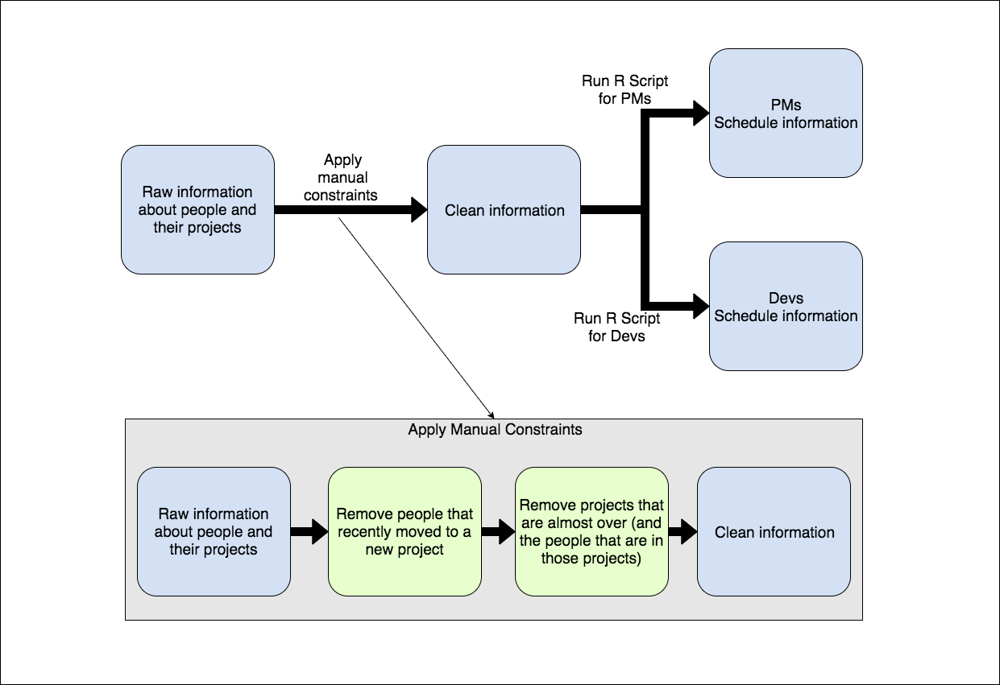
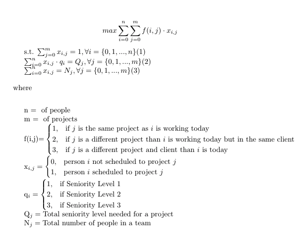

# People-Scheduling
Scheduler of people for a consultancy company

We have been having problems to schedule people in different projects manually. Thinking about that, I created a R script to facilitate the scheduling following some constraints.

## The model
We have one Project Manager (PMs) and X (x>=1) Developers (Devs) for each project. Besides that, we have some constraints:
1. The projects have seniority needs. Some need more senior devs/pms, others don't.
2. We need to prioritize the change of clients, so if one person is at client X today, it would be better to put him/her on another client.
3. If the aforementioned client change is not possible, we should try to change projects inside the client.
4. It shouldn't change people from projects if the time of the person in the project is lower than 3 months.
5. It shouldn't change people from projects if the time remaining for the project end is lower than 3 months.
6. Projects have a fixed amount of people.
7. Each person works in only one project at a time.

Thinking about that, I decided divide the flow as:

We are applying the constraints 4 and 5 manually before the script. I decided to do that because they're easy to apply manually and because its existance would only make the Linear Programming model more difficult to achieve.

To explain how the input of the R script needs to be divided, we need to understand the Linear Programming model that I developed:

In this model, (1) is our constraint #7, (2) is our constraint #1 and (3) is our constraint number 6.
The constraints 2 and 3 are actually prioritizations, so we used the obj function to reach the best outcome possible by giving a higher value for scheduling people in different clients, then a smaller value for different projects and an even smaller value for same projects.

Besides that, I broke the scheduling problem between a PMs problem and a Devs problem. So you'll need to run two simulations, one for PMs and one for Devs.

## How to use it
You'll need 4 different files as input to the R script, that have the same name as their equivalent on the model.
* F(i,j).csv is a file where you put the values for each person and each project.
* Nj.csv is a file containing the projects and the total amount of people needed for the project
* Qj.csv contains each project and the total seniority that the project needs
* qi.csv contains the seniority level for each person

After doing that, you just run the script and a new solution.csv will be built.
The csv will contain five (5) solutions for your scheduling problem and to read it better, I suggest editing it since it will come with all the results concatenated with no blank spaces.

